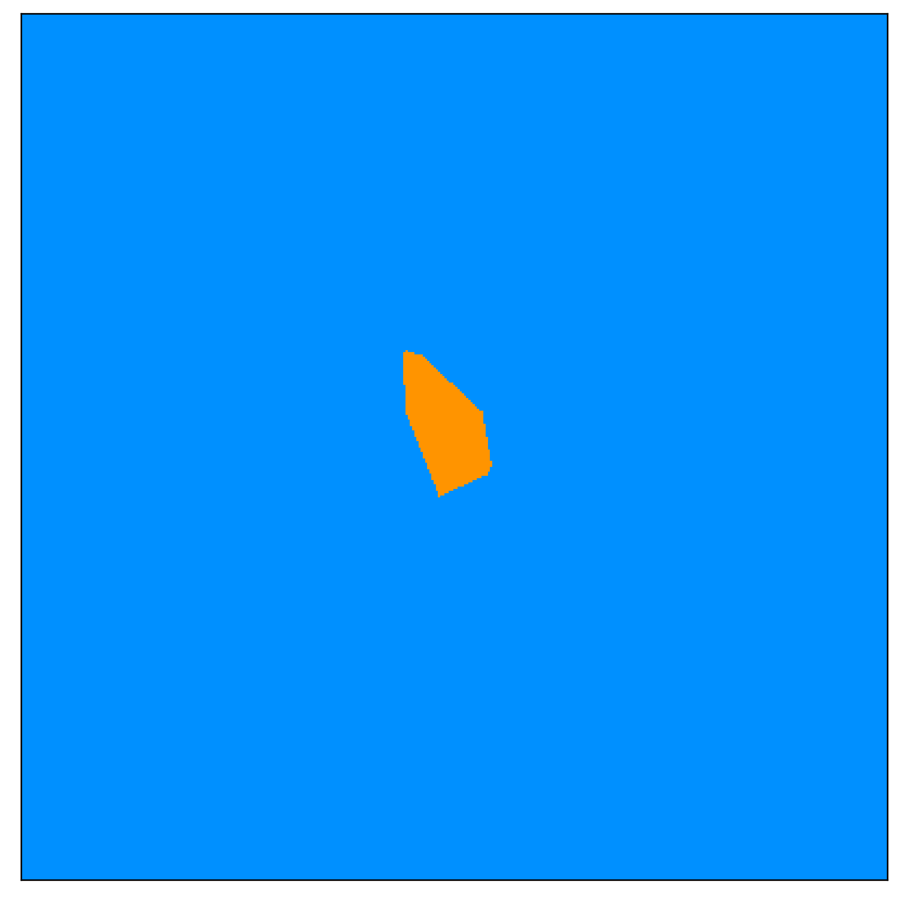
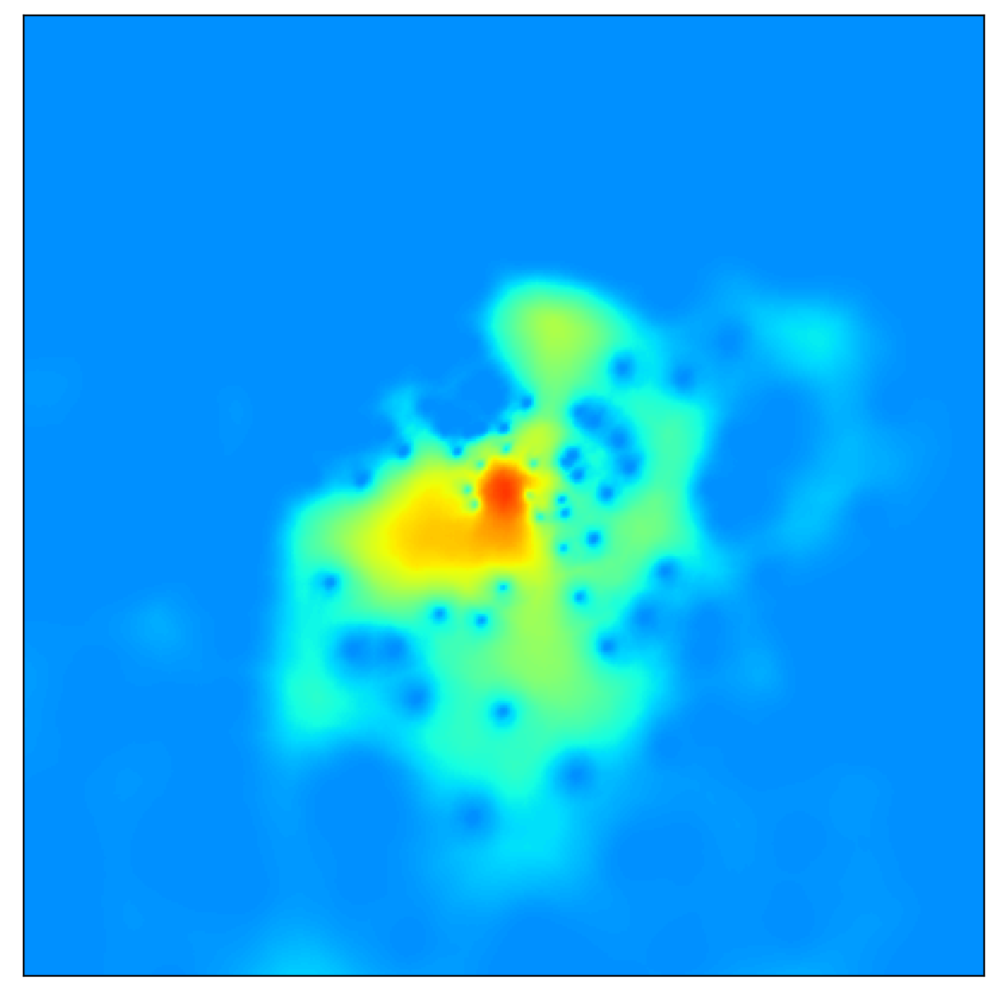

# Simplifier: Reliable and Scalable Spatial Diffusion of Mobile Network Metadata from Base Station Locations

The mapping of metadata collected at cellular Base Stations (BSs) to the geographical area they cover is a cardinal operation for a wide range of studies across many scientific disciplines. The task requires modeling the spatial diffusion of each BS, i.e., the probability that a device associated with the BS is at a specific location. While precise spatial diffusion data can be estimated from elaborate processing of comprehensive information about the Radio Access Network (RAN) deployment, researchers tend to have access to meager data about the RAN, often limited to the sole location of the BSs. This makes simplistic approximations based on Voronoi tessellation the de-facto standard approach for diffusion modeling in most of the literature relying on mobile network metadata.

Some of the studies that rely on Voronoi tessellation includes:

* [Second-level Digital Divide: A Longitudinal Study of Mobile Traffic Consumption Imbalance in France.](link)
* [News or social media? Socio-economic divide of mobile service consumption.](link)
* [Impact of Later-Stages COVID-19 Response Measures on Spatiotemporal Mobile Service Usage.](link)
* [CellSense: Human Mobility Recovery via Cellular Network Data Enhancement.](link)
* [Jane Jacobs in the Sky: Predicting Urban Vitality with Open Satellite Data.](link)
* [On the estimation of spatial density from mobile network operator data.](link)
* [COVID-19 Flow-Maps an open geographic information system on COVID-19 and human mobility for Spain.](link)
* [Estimation of urban zonal speed dynamics from user-activity-dependent positioning data and regional paths.](link)
* [CellRep: Usage Representativeness Modeling and Correction Based on Multiple City-Scale Cellular Networks.](link)
* [Detecting Areas of Potential High Prevalence of Chagas in Argentina.](link)
* [Characterizing and Removing Oscillations in Mobile Phone Location Data.](link)
* [Inferring dynamic origin-destination flows by transport mode using mobile phone data.](link)
* [Joint spatial and temporal classification of mobile traffic demands.](link)
* [Combining disparate data sources for improved poverty prediction and mapping.](link)
* [The Death and Life of Great Italian Cities: A Mobile Phone Data Perspective.](link)
* [Linking Users Across Domains with Location Data: Theory and Validation.](link)
* [Content consumption cartography of the paris urban region using cellular probe data](link)
* [Understanding individual human mobility patterns.](link)

**Simplifier**, lets any researcher immediately and substantially improve the spatial mapping of mobile network metadata.


<br>
<br>

| Operator coverage | Voronoi | Simplifier |
|:-----------------:|:-------:|:------------:|
|  |  | |
|  |  | |
|  |  | |
|  |  | |
|  |  | |

## Installation and Usage

Clone this repository and install the requirements:

```bash
# clone the repository
git clone https://github.com/nds-group/simplifier.git
# go to the simplifier folder
cd simplifier
# install the requirements
pip install -r requirements.txt

# unzip the model
unzip Simplifier_SDUnet_ks2_015.zip
```

First is need to import the VoronoiBoost class from the simplifier.py file:

```python
from simplifier import Simplifier
```

Simplifier use the same input as a standard voronoi tesselation,

* **site**: set of points, i.e: base stations locations
* **region**: the region of interest, i.e: France, Paris
* **meter_projection**: the projection of the region, i.e: 'epsg:2154'
* **model_path**: the path to the model to use for the spatial diffusion estimation.
* **compute_voronoi_tessellation**: flag to compute the voronoi tessellation or not.

```python
simplifier = Simplifier(sites, 
                        france_geojson, 
                        'epsg:2154', 
                        model_path='Simplifier_SDUnet_ks2_015',
                        compute_voronoi_tessellation = True)
```

The simplifier class has three main methods:

* **get_voronoi**: return the voronoi tessellation
* **get_prediction**: return the spatial diffusion estimation

```python
prediction, _ = simplifier.get_prediction(site_index)
voronoi_cell_matrix = simplifier.get_voronoi(site_index)
```