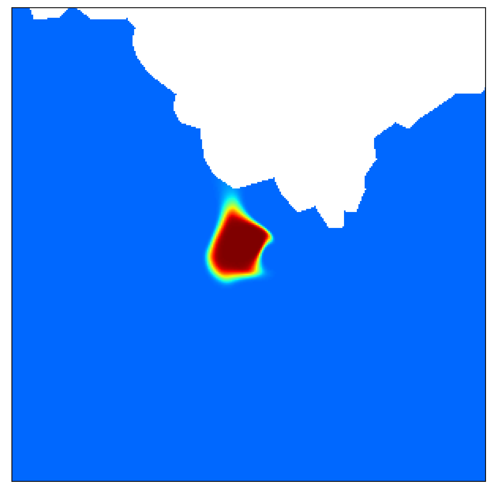

# Simplifier: Reliable and Scalable Spatial Diffusion of Mobile Network Metadata from Base Station Locations

Simplifier, lets any researcher immediately and substantially improve the spatial mapping of mobile network metadata.

 

 

 

 
</div